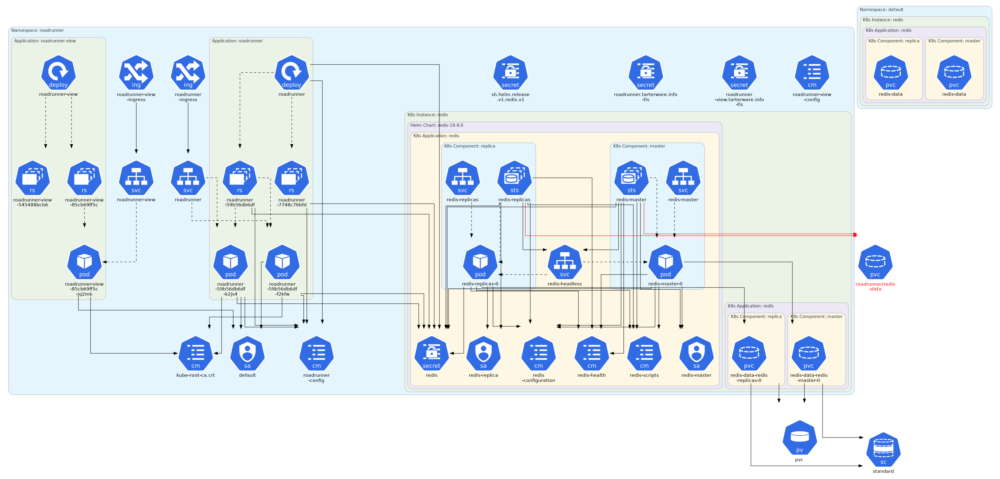

## Description
This project provides Terraform scripts and instructions to deploy the Roadrunner application on either an AWS EKS cluster or a Minikube setup.  The runtime consists of two applications: a server application [roadrunner](https://github.com/SteveTarter/roadrunner) and a view application [roadrunner-view](https://github.com/SteveTarter/roadrunner-view).

## Prerequisites
This project assumes you have a cluster created using resources available at [SteveTarter / eks-with-efs-and-alb](https://github.com/SteveTarter/eks-with-efs-and-alb). The referenced Terraform scripts set up an EKS cluster with the necessary infrastructure. Alternatively, instructions for setting up a compatible Minikube environment are included there.

Roadrunner relies on [Auth0](https://auth0.com/) for authentication and [Mapbox](https://www.mapbox.com/) for mapping services. Both providers offer trial accounts that you can use to generate the necessary tokens.

## Preparation
To deploy the application, clone this repository and navigate to the project directory. Next, create a `terraform.tfvars` file and populate it with sensitive variables. Below is an example:

```hcl
# terraform.tfvars
mapbox_api_key                      = ""
spring_mail_username                = ""
spring_mail_password                = ""
auth0_api_audience                  = ""
auth0_api_rest_url_base             = ""
auth0_api_client_id                 = ""
auth0_api_client_secret             = ""
auth0_api_scope                     = ""
auth0_api_issuer_url                = ""
auth0_api_domain                    = ""
tarterware_api_audience             = ""
roadrunner_view_auth0_client_id     = ""
roadrunner_view_auth0_client_secret = ""
```

### EKS Configuration
Create an `eks.tfvars` file with the following content, replacing placeholders with appropriate values:

```hcl
# eks.tfvars
cluster_name                 = "<arn of cluster>"
region                       = "us-east-1"
roadrunner_namespace         = "roadrunner"
roadrunner_rest_url_base     = "https://roadrunner.<my-domain>.com"
roadrunner_view_url_base     = "https://roadrunner-view.<my-domain>.com"
tarterware_data_dir          = "/tarterware-data"
tarterware_cert_arn          = "<arn of certificate>"
eks_vpc_name                 = "tarterware-eks-vpc"
efs_sg_name                  = "efs-sg"
```

### Minikube Configuration
Create a `minikube.tfvars` file with the following content:

```hcl
# minikube.tfvars
cluster_name               = "minikube"
region                     = ""
roadrunner_namespace       = "roadrunner"
roadrunner_rest_url_base   = "https://roadrunner.tarterware.info"
roadrunner_view_url_base   = "https://roadrunner-view.tarterware.info"
tarterware_data_dir        = "/tarterware-data"
tarterware_cert_arn        = ""
eks_vpc_name               = ""
efs_sg_name                = ""
```

### Create Terraform Workspaces
Ensure separate Terraform workspaces exist for EKS and Minikube:

```bash
terraform workspace new eks
terraform workspace new minikube
```

## Kubernetes Architecture Diagram
The following diagram was created using [KubeDiagrams](https://github.com/philippemerle/KubeDiagrams.git).  It shows the Roadrunner application deployed to Minikube.  The bulk of the system described in these Terraform files is shown in the left half of the diagram; the right side of the diagram represents the Redis installation :



## Certificates for Minikube
Refer to `create-cert-authority.txt` and `create-roadrunner-certs.txt` for generating certificates. These instructions were developed for Ubuntu. Windows users may need to run the scripts in an Ubuntu environment. The certificate authority (CA) must be installed in your browser for proper TLS validation.

For EKS, request a wildcard certificate that supports subdomains (e.g., `*.tarterware.com`).

## Installation on Minikube
1. Update your `/etc/hosts` file to map domain names to the Minikube IP address. First, get the IP:

```bash
minikube ip
```

Add an entry like this to your `/etc/hosts` file:

```
192.168.39.71    roadrunner.tarterware.info roadrunner-view.tarterware.info
```

2. Select the Minikube workspace and context:

```bash
terraform workspace select minikube
kubectl config use-context minikube
```

3. Deploy the application:

```bash
terraform init -upgrade
terraform plan -var-file=minikube.tfvars
terraform apply -var-file=minikube.tfvars
```

## Installation on AWS EKS
1. Select the EKS workspace and context:

```bash
terraform workspace select eks
kubectl config use-context <arn-of-cluster>
```

2. Deploy the application:

```bash
terraform init -upgrade
terraform plan -var-file=eks.tfvars
terraform apply -var-file=eks.tfvars
```

